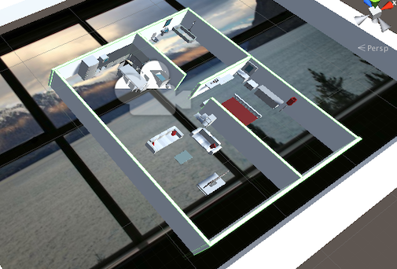

# Augmented Reality iOS/Android Window
> An AR window, looking through the tracked image will show you a glimpse into a created 3D scene.
>Will add more later, but for now just testing.

## Table of contents
* [General info](#general-info)
* [Screenshots](#screenshots)
* [Technologies](#technologies)
* [Setup](#setup)
* [Features](#features)
* [Status](#status)
* [Inspiration](#inspiration)
* [Contact](#contact)

## General info
I created this app to test the capabilities of Unity3D and Vuforia for AR production apps. I wanted to learn more about AR/VR and understand how difficult it is to make large scale apps.
This app works on iOS/Android through the camera, print out the image and track it.

## Screenshots



## Technologies
* Unity3D - 2018.3.12
* C# - Unsure what v
* Vuforia - v8.1

## Setup
```
git clone git@github.com:tekm/AR-Window.git
cd AR-Window
Open in Unity3D/Drag & Drop
Export to iOS/Android device and test on your personal device
```

## Features
List of features ready and TODOs for future development
* Full Viewable in iOS/Android Camera
* Trackable points allow for you to view into the scene very close
* Detailed scene to look into

To-do list:
* Create a more detailed 3D scene to look at 
* Create a background with more tracking points
* Print out photo and create demo video 

## Status
Project is: _Complete_

## Inspiration
Nintendo 3DS AR Camera\
Pokemon GO

## Contact
Email: logan.kane1@gmail.com\
Github: [tekm](github.com/tekm)
